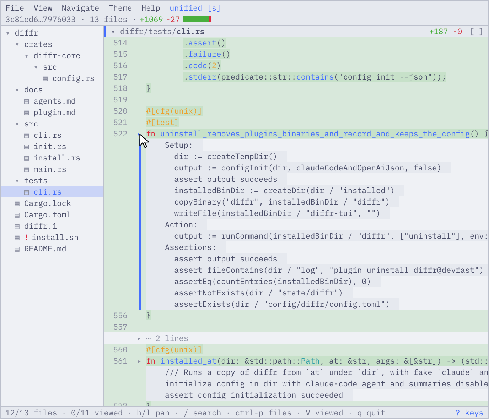
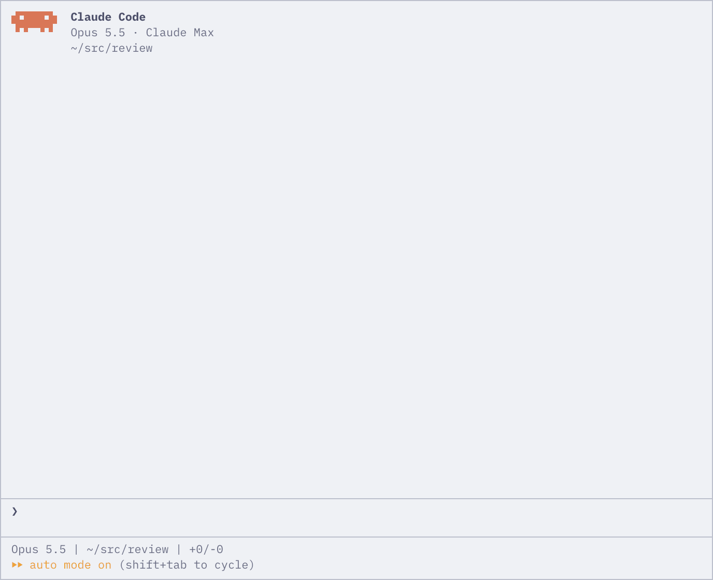
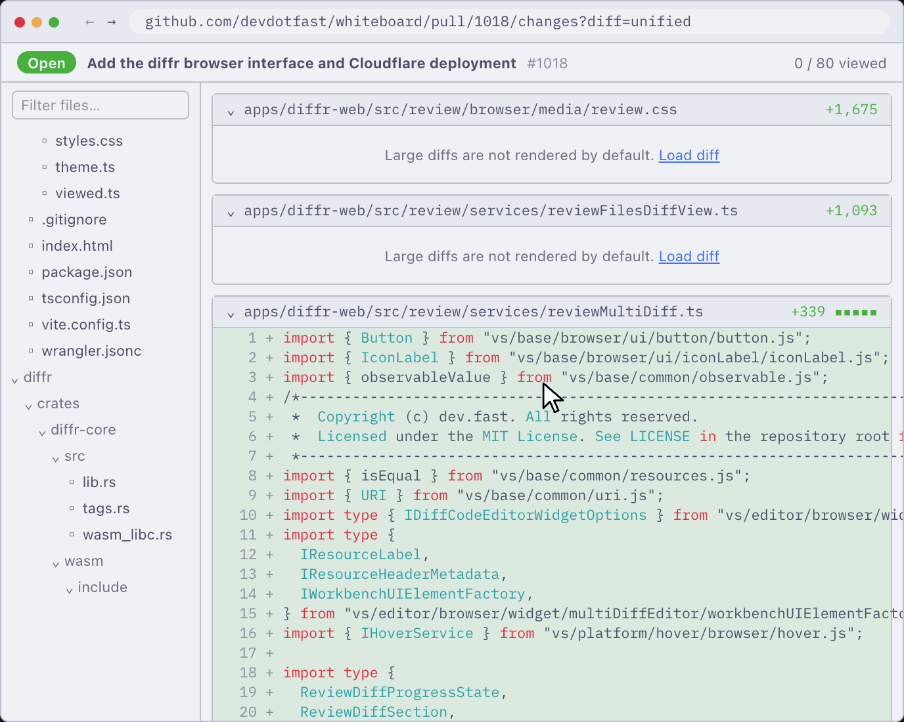
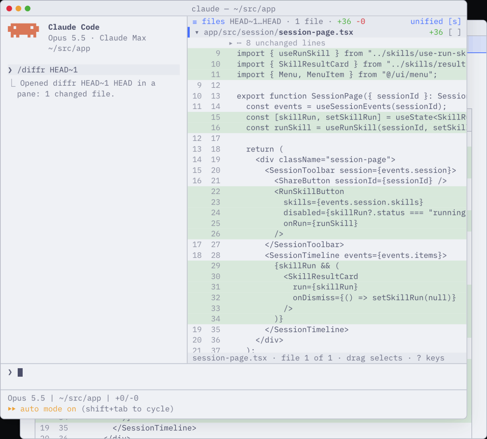
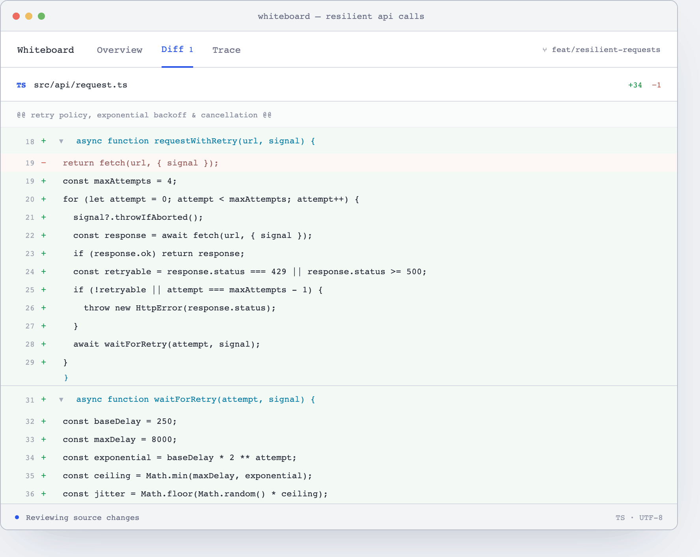

# diffr

> diffr is still experimental. Read the [blog post](https://dev.fast/blog/diffr/) for more info about why we built it!

At its core, diffr is a Rust-based structural diffing (AST-aware) library with a WASM plugin system. The plugin system allows you to do things like collapse noisy unit tests, or summarize long code blocks in pseudocode. It also ships with a variety of clients:

1. An interactive TUI with AST-aware code folding.
   

2. Diffr is also available natively in claude code as a mod via `/diffr`. You can view and comment on diffs without switching tabs:

   

3. It's also available as a fun, client-side only website! See [diffs.fast](https://diffs.fast). All of the computation (WASM plugins, code folding, summarization) happens exclusively on your device. In this configuration, `diffr` runs in WASM and streams results back to the frontend.

   

4. [WASM-based plugin system](docs/plugin.md). You can customize your view of diffs by vibe coding plugins and dynamically collapse portions that you find to be low-signal:

   

  And we're working on interactive views which are deeply integrated with the Whiteboard app:

  

## Usage

`diffr` accepts the exact same arguments that `git diff` does when invoked on the command line:

```sh
diffr                         # index versus working tree
diffr --cached                # staged changes
diffr main...HEAD -- src/      # merge-base comparison
```

When installed as a Claude Code mod, you can invoke it via `/diffr`. Claude also has a tool it can use to invoke a diffs view to show you file(s) as well.

## Installation

### Install Script (Preferred)

Run the script below + follow its setup instructions:

```sh
curl -fsSL https://install.dev.fast/diffr | sh
```

This will also guide you through the setup instructions for the Claude Code integration.

### Alternative Methods:

You can use homebrew (Apple Silicon macOS, Intel macOS, and x64/ARM64 Linux):

```sh
# Install the CLI + TUI
brew install devdotfast/tap/diffr
# Install in-coding agent diff viewing experiences:
diffr config init
```

The CLI, from crates.io (prebuilt via [cargo-binstall](https://github.com/cargo-bins/cargo-binstall), or compiled):

```sh
cargo binstall diffr-cli
cargo install diffr-cli --locked
```

Windows x64: download `diffr-<version>-<target>.tar.gz` from [Whiteboard Releases](https://github.com/devdotfast/whiteboard/releases) and extract it with `tar -xzf`, or use `cargo binstall`.

## Configuration

`diffr`'s config page is accessible via `diffr config`. Your agent can also customize it for you; just ask it to do so (there are instructions for your agent under `diffr --help`).

To set up pseudocode summarization (or any other customization), you can:

1. Run `diffr config init` to get onboarded to diffr.
2. Alternatively, run `diffr config` to get dropped to the settings page.
  - Run diffr config
  - Search for 'summarization'
  - Enable in the dropdown
  - Pick a provider and model, and add its API key unless GEMINI_API_KEY, OPENAI_API_KEY or ANTHROPIC_API_KEY is already in your environment
3. Through `Cmd + P > Settings` in the Whiteboard app.

## History

diffr is sourced heavily from two other great open-source projects:

1. The lovely [difftastic](https://github.com/Wilfred/difftastic)(MIT, Wilfred Hughes), which powers its structural diffing algorithm.
2. Its terminal UI was taken from [hunk](https://github.com/modem-dev/hunk) (MIT, Modem Labs), which itself uses OpenTUI.

We forked these projects because of the following 3 technical reasons:

1. AST-based fold matching: we didn't want just structural diffing; with the power of tree-sitter queries, you can also match AST *folds* across new/old files and get a more intuitive review experience:
2. Plugin System: We started to review lightweight diffs but realized that every language, team, and developer was different. We're striving towards the ideal where you can customize your own review - for example, filter to only files and types which are important to you.
  - By default, we have plugins set up that collapse unit tests, and summarize long code blocks in pseudocode.
3. TUI affordance - for small diffs it's too heavyweight to have a full review app, or even github. We kept things in Typescript for the MVP here; this will be rewritten in pure Rust.

We hope in the future that we can find some way to upstream some / all of these features. Obviously everyone works differently and this is quite an opinionated stance on things, so we imagine this may take time.


### Plugin API

`diffr` has a powerful, wasm-based plugin API which customizes how it presents changed files. For more details, read the [docs](./docs/plugin.md).

> Note: The plugin API is a bit awkward and will be simplified radically in the coming releases. It is still not stable!

## License

MIT. See `LICENSE` for the terms and `NOTICE` for the third-party work
diffr builds on, starting with the lovely
[difftastic](https://github.com/Wilfred/difftastic).
