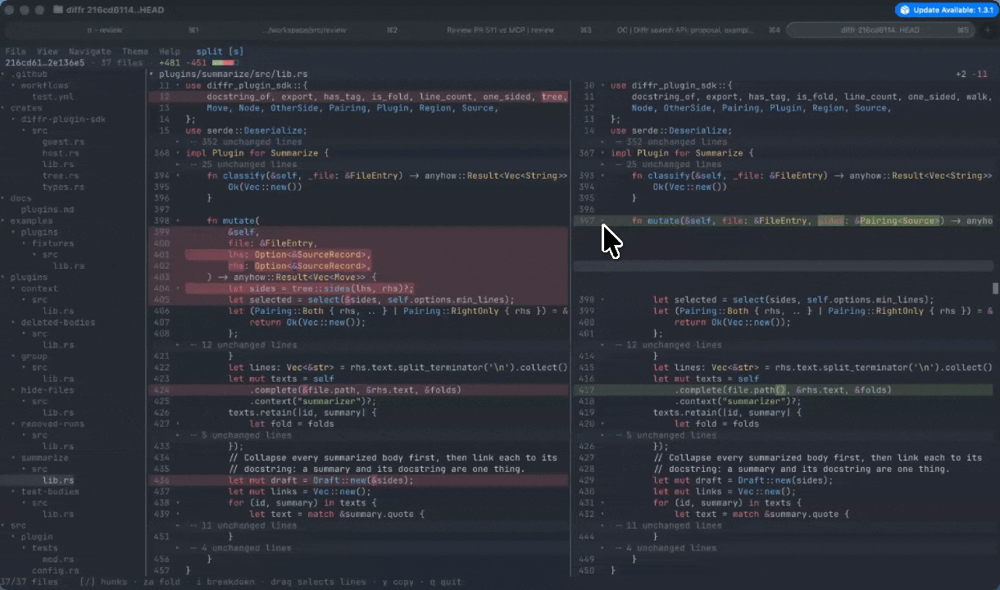
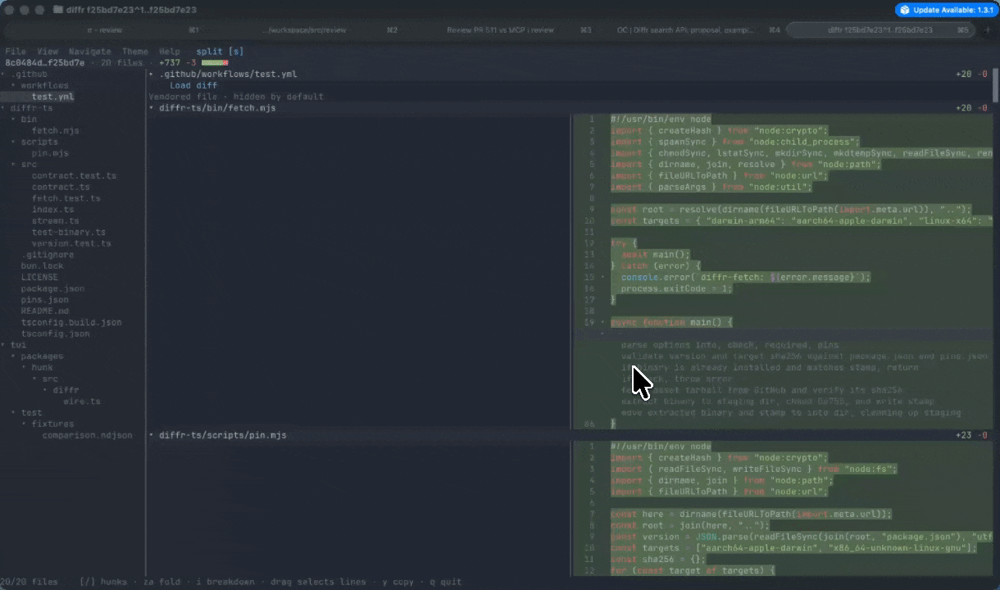

# diffr

> diffr is experimental and in alpha. API breakages are possible at any time, although we will do our best to warn you of them.

diffr is a Rust-based structural diffing (AST-aware) library. It is also packaged as a CLI with a built-in TUI, and it has a WASM plugin system for extensibility. 

## Features

1. Interactive TUI with AST-aware code folding

   

2. Sane defaults for AI coding
   - Summarize long changes as pseudocode
   - Collapse tests and docs

   

3. [WASM-based plugin system](docs/plugin.md)

## Usage

`diffr` accepts the exact same arguments that `git diff` does.

```sh
diffr                         # index versus working tree
diffr --cached                # staged changes
diffr main...HEAD -- src/      # merge-base comparison
```

## Installation

CLI and terminal UI (Apple Silicon macOS, Intel macOS, and x64/ARM64 Linux):

```sh
brew install devdotfast/tap/diffr
```

The CLI, from crates.io (prebuilt via [cargo-binstall](https://github.com/cargo-bins/cargo-binstall), or compiled):

```sh
cargo binstall diffr-cli
cargo install diffr-cli --locked
```

Windows x64: download `diffr-<version>-<target>.tar.gz` from [Whiteboard Releases](https://github.com/devdotfast/whiteboard/releases) and extract it with `tar -xzf`, or use `cargo binstall`.

TODO(smenon):UPDATEME!

## History

diffr is a fork of the lovely [difftastic](https://github.com/Wilfred/difftastic)(MIT, Wilfred Hughes) and its terminal UI from
[hunk](https://github.com/modem-dev/hunk) (MIT, Modem Labs).

We forked [difftastic](https://github.com/Wilfred/difftastic) because of the following 3 technical reasons:

1. TUI affordance
2. AST-based fold matching
3. Plugin System

We hope in the future that we can find some way to upstream some / all of these features. Obviously everyone works differently and this is quite an opinionated stance on things, so we imagine this may take time.

## Known Limitations

1. Semantic diff summarization calls Gemini, OpenAI (or any OpenAI-compatible server, such as Ollama, via `endpoint`), or Anthropic. It is off by default. Turn it on via:
  a. Through the TUI:
    - Run `diffr config`
    - Search for 'summarization'
    - Enable in the dropdown
    - Pick a provider and model, and add its API key unless `GEMINI_API_KEY`, `OPENAI_API_KEY` or `ANTHROPIC_API_KEY` is already in your environment
  b. Through the [Whiteboard app](https://github.com/devdotfast/whiteboard).
2. The plugin API is a bit awkward and will be simplified radically in the coming releases.

### Plugin API

`diffr` has a powerful, wasm-based plugin API which customizes how it presents changed files. For more details, read the [docs](./docs/plugin.md).

## License

MIT. See `LICENSE` for the terms and `NOTICE` for the third-party work
diffr builds on, starting with the lovely
[difftastic](https://github.com/Wilfred/difftastic).
