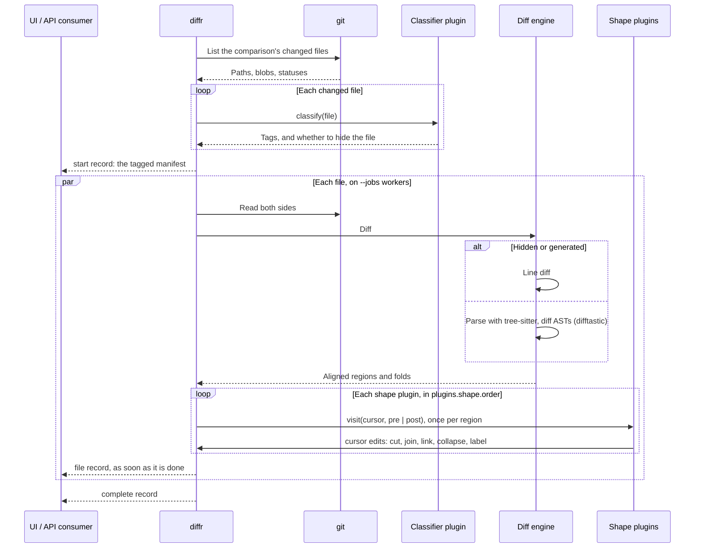

# Plugin Architecture

`diffr` has a powerful, wasm-based plugin API which customizes how it presents changed files.

For example, the following are all implemented as plugins:

- Context Folding: showing relevant context, like a function signature + closing brace (if applicable)
- Algorithm Summarization: using an LLM to summarize long algorithms into pseudocode
- Comment collapsing: collapsing long LLM comments + function bodies & expanding both at once
- Collapsing tests by default

## Architecture

When you run `diffr ${commit_range_exp}`, the following happens:

1. Commits loaded from git
2. Plugins (explained in more detail later) load. There are two types of plugins: classifier + shape.
3. A classifier plugin tags a file as `generated`, `test`-only, etc. These are not put through expensive structural diffing
   and, by default, are collapsed in diff viewer clients like the TUI.
4. Each remaining file is parsed via tree-sitter & diffed using difftastic's ast/ast diffing algorithm
  - This produces an alignment of file / file
  - Note: because of known upstream limitations, the diffing algorithm is quite CPU/Mem intensive.
    We fall back to a textual diffing algorithm in case of issue
5. Shape plugins define which AST nodes are present in the API + folded by default.



## Plugin Interface

Plugins are defined by a WASM interface is defined in
[`crates/diffr-plugin-sdk/wit/plugin.wit`](../crates/diffr-plugin-sdk/wit/plugin.wit).

The classifier plugin implements the generated `GuestClassifier` trait; it determines if and how an entire file is (1) collapsed and (2) skips structural diffing:

```rust
use diffr_plugin_sdk::prelude::*;

struct MyClassifier;
impl ClassifierGuest for MyClassifier {
    type Classifier = Self;
}
impl GuestClassifier for MyClassifier {
    fn new(options: String) -> Result<Self, String> { Ok(Self) }
    fn classify(&self, file: FileEntry) -> Result<Classification, String> {
        Ok(Classification { tags: vec![Tag::Custom("schema".into())], hidden: None })
    }
}
export_classifier!(MyClassifier);
```

A shape plugin implements the generated `GuestPlugin` trait; it will be reminiscent of golang's [astutil.Apply](https://pkg.go.dev/golang.org/x/tools/go/ast/astutil#Apply), for those familiar. Shape plugins determine the presentation of individual AST folds in an open file (e.g. collapsing + replacing w pseudocode, or them grouping together, and so on):

```rust
use diffr_plugin_sdk::prelude::*;

struct MyPlugin;
impl Guest for MyPlugin {
    type Plugin = Self;
}
impl GuestPlugin for MyPlugin {
    fn new(options: String) -> Result<Self, String> { Ok(Self) }
    // cursor is a host-provided interface over the matched ast tree(s); phase indicates preorder/postorder.
    async fn visit(&self, cursor: &Cursor, phase: Visit) -> Result<bool, String> {
        // Inspect this node and edit it through the host cursor.
        Ok(true)
    }
}
export_shape!(MyPlugin);
```

## Configuration format 2

```toml
version = 2

[plugins.shape]
order = ["bundled.deleted-bodies", "bundled.summarize", "bundled.test-bodies", "bundled.removed-runs", "bundled.context"]

[plugins.shape.bundled.context]
lines = 8

[plugins.shape.bundled.summarize]
enabled = true
provider = "openai"
model = "my-model"
system_prompt = "Keep my custom summary instruction."

[plugins.classify.bundled]
hide = ["generated", "vendored"]
hide_deleted = true
```

```sh
diffr config set plugins.shape.bundled.context.lines 8
diffr config set plugins.classify.bundled.hide_deleted false
```
